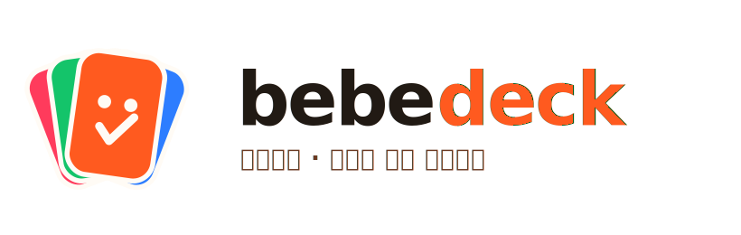

  
  
<strong>월령별 안심 큐레이션 · 육아도감</strong>

---

# bebedeck Brand Kit

아이의 월령(발달단계)에 맞춰 교구·식품·식기 등 필수템을 큐레이션하고, 안전인증·성분분석 지표로 **안심 구매**를 돕는 육아 앱 **bebedeck**의 브랜드 가이드입니다.

## 1. 브랜드 한 줄

> 우리 아이 지금 이 시기에 필요한 것만, 안심하고.

- **이름**: `bebedeck` — *bebe*(아기) + *deck*(카드 묶음/큐레이션). 우리말로는 **육아도감**.
- **메타포**: 월령마다 펼쳐 보는 카드 한 벌 = "도감(dex)". 카드 한 장 = 검증된 아이템 하나.
- **핵심 약속**: 정보 과잉의 육아에서 *고를 것을 줄여주는* 큐레이션 + *믿을 수 있는* 지표.

## 2. 브랜드 퍼스낼리티

| 축 | bebedeck는 | bebedeck는 아니다 |
|---|---|---|
| 톤 | 밝고 쨍한, 활기찬 | 차분하고 무채색인 |
| 태도 | 똑부러지게 골라주는 | 모든 걸 나열하는 |
| 신뢰 | 근거(인증·성분)로 안심시키는 | 감성으로만 설득하는 |
| 거리감 | 친구 같은 육아 메이트 | 권위적인 전문가 |

**보이스**: 짧고 명확하게. 부모를 가르치지 않고, 결정을 거들어줍니다. ("이 시기엔 이게 좋아요" O / "반드시 사야 합니다" X)

## 3. 컬러 시스템

쨍한 멀티컬러를 키컬러로 사용합니다. 각 색은 큐레이션 카테고리·지표와 매핑됩니다.

| 토큰 | HEX | 역할 |
|---|---|---|
| 🟠 Tangerine | `#FF5A1F` | **Primary** — 메인/CTA/강조 |
| 🟢 Leaf | `#14C46A` | 성분·안전 OK, 식품 |
| 🔵 Azure | `#2D7DFF` | 안전인증·신뢰, 정보 |
| 🔴 Coral | `#FF3B5C` | 알림·주의 배지, 식기/포인트 |
| 🟤 Cocoa | `#6B3A23` | 오렌지브라운 — 딥 텍스트/보조 |
| ⚫ Ink | `#211A14` | 본문 텍스트 |
| ⚪ Paper | `#FFFBF5` | 배경(웜 화이트) |

> 사용 비율 가이드: **Tangerine 60% · 뉴트럴 30% · 나머지 키컬러 10%**. 한 화면에서 키컬러 4개를 동시에 강하게 쓰지 말고, 하나를 주인공으로.

토큰은 [`tokens/colors.css`](tokens/colors.css), [`tokens/tokens.json`](tokens/tokens.json) 참고.

## 4. 로고

| 파일 | 용도 |
|---|---|
| [`logo/bebedeck-lockup.svg`](logo/bebedeck-lockup.svg) | 기본 가로 락업(마크+워드마크+태그라인) |
| [`logo/bebedeck-mark.svg`](logo/bebedeck-mark.svg) | 심볼 단독 (펼친 카드 = deck) |
| [`logo/bebedeck-wordmark.svg`](logo/bebedeck-wordmark.svg) | 워드마크 단독 |
| [`logo/bebedeck-app-icon.svg`](logo/bebedeck-app-icon.svg) | 앱 아이콘 |
| [`logo/bebedeck-mark-mono.svg`](logo/bebedeck-mark-mono.svg) | 단색(라인) — 작은 크기/단색 인쇄 |

**심볼 의미**: 펼쳐진 4장의 카드(오렌지·그린·블루·코랄)는 카테고리 큐레이션을, 앞장의 체크 표정(✓ = 웃는 입)은 "검증되어 안심"을 뜻합니다.

**사용 규칙**
- 최소 여백: 마크 높이의 25% 이상 확보.
- 최소 크기: 락업 24px, 마크 16px 이상.
- 금지: 색 임의 변경, 비율 왜곡, 그림자/외곽선 추가, 쨍하지 않은 배경 위에서 대비 부족하게 사용.

## 5. 타이포그래피

| 용도 | 폰트 | 비고 |
|---|---|---|
| 로고·영문 헤드라인 | **Poppins** (또는 Quicksand) 700 | 둥근 지오메트릭, letter-spacing -2~-3 |
| 한글 제목/본문 | **Pretendard** | 무료, 가변·웹폰트 지원 |

영문 둥근 산세리프 + 한글 Pretendard 조합으로 친근함과 가독성을 함께 가져갑니다.

## 6. 적용 미리보기

브랜드 시트를 한눈에 보려면 [`preview.html`](preview.html)을 브라우저에서 열어보세요.

---

© bebedeck. 이 레포의 에셋은 bebedeck 브랜드 전용입니다. 워드마크의 `<text>`는 최종 핸드오프 시 아웃라인(path) 변환을 권장합니다.
